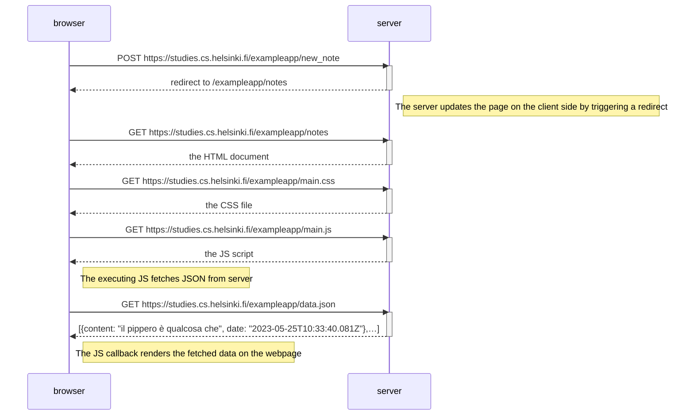

```mermaid
sequenceDiagram  
    participant browser  
    participant server  

    browser->>server: POST https://studies.cs.helsinki.fi/exampleapp/new_note
    activate server
    server-->>browser: redirect to /exampleapp/notes
    deactivate server

    Note right of server: The server updates the page on the client side by triggering a redirect

    browser->>server: GET https://studies.cs.helsinki.fi/exampleapp/notes
    activate server
    server-->>browser: the HTML document
    deactivate server

    browser->>server: GET https://studies.cs.helsinki.fi/exampleapp/main.css
    activate server
    server-->>browser: the CSS file
    deactivate server

    browser->>server: GET https://studies.cs.helsinki.fi/exampleapp/main.js
    activate server
    server-->>browser: the JS script
    deactivate server

    Note right of browser: The executing JS fetches JSON from server

    browser->>server: GET https://studies.cs.helsinki.fi/exampleapp/data.json
    activate server
    server-->>browser: [{content: "il pippero è qualcosa che", date: "2023-05-25T10:33:40.081Z"},…]
    deactivate server

    Note right of browser: The JS callback renders the fetched data on the webpage
```